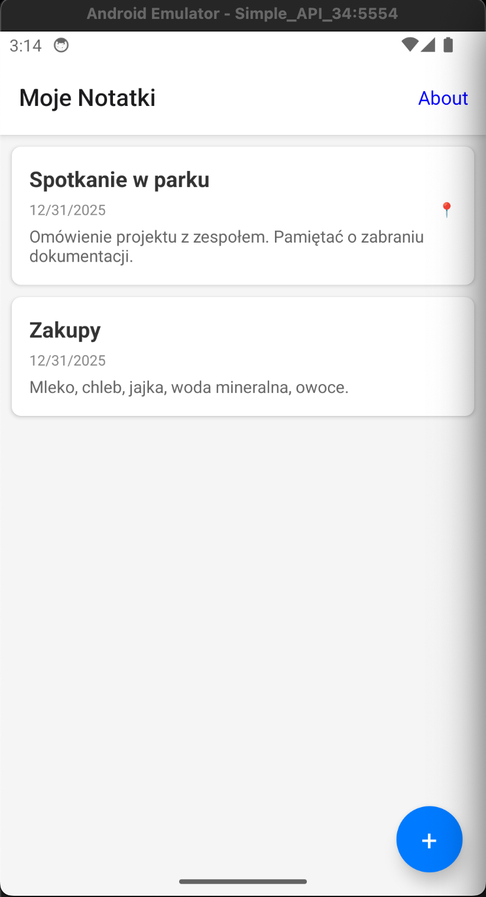
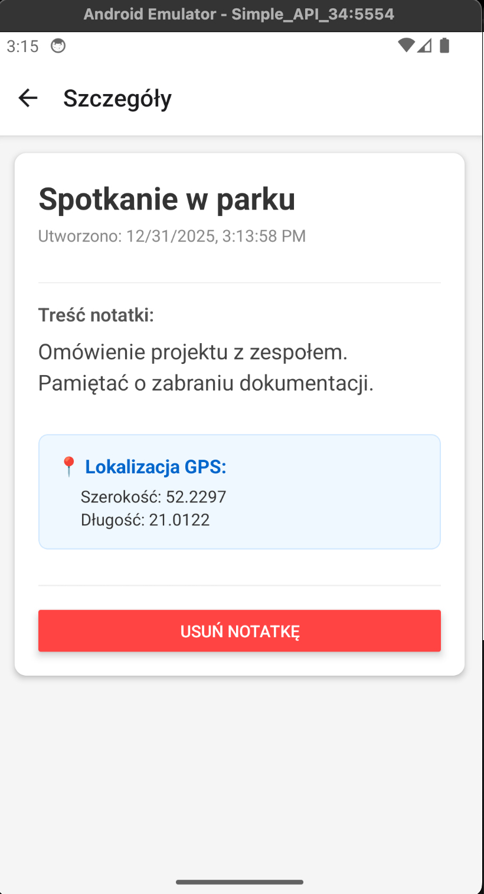
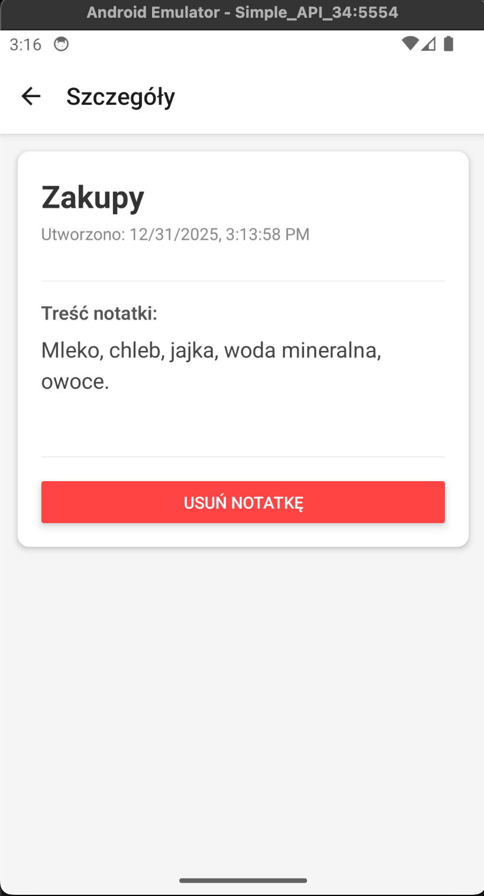
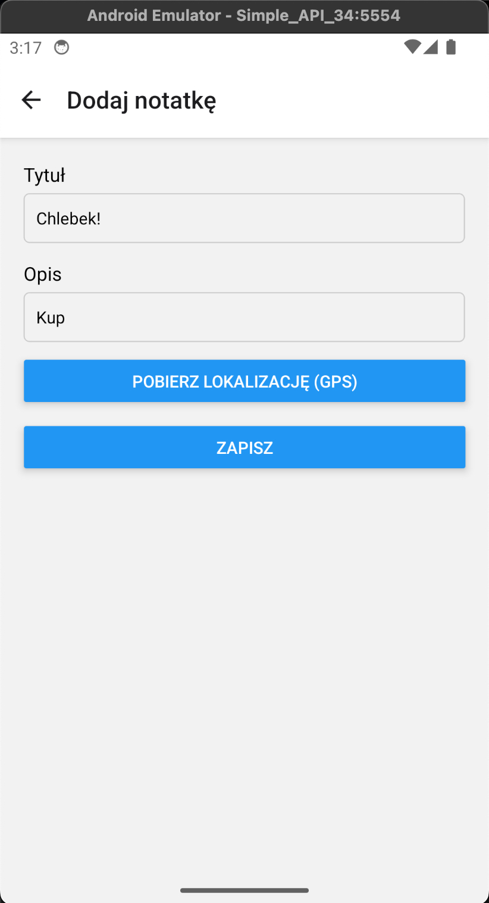
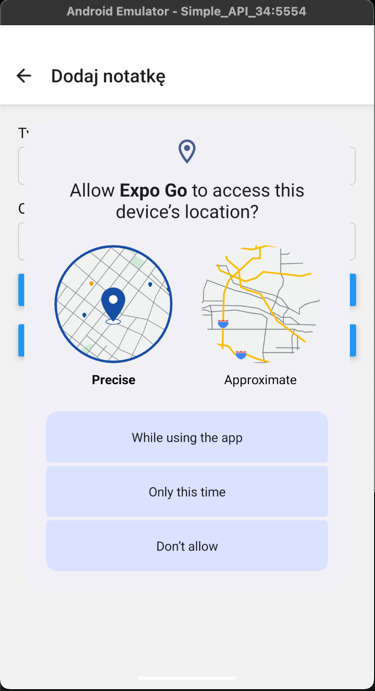
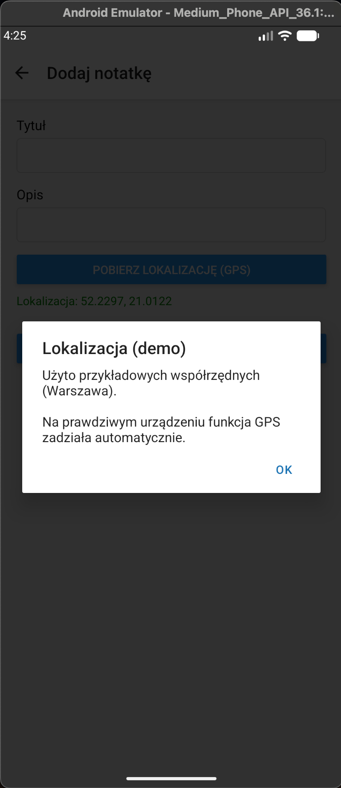
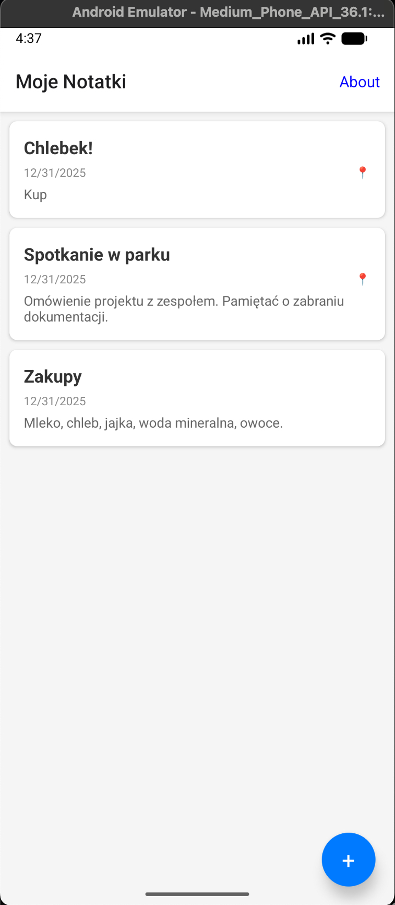
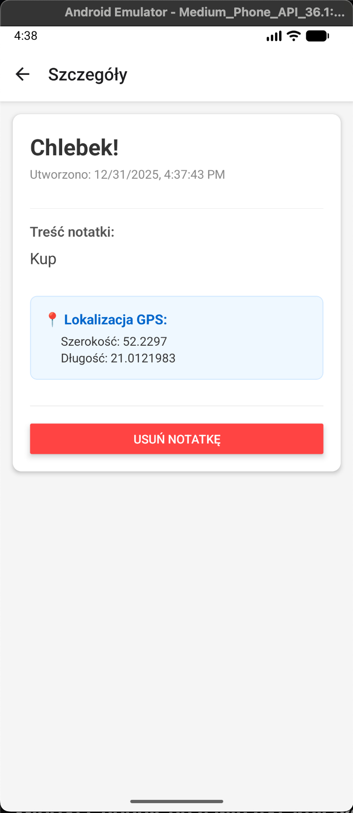

# Field Notes (React Native)

## Opis Projektu

**Field Notes** to aplikacja mobilna stworzona w technologii React Native (Expo), służąca do zbierania notatek terenowych wzbogaconych o dane lokalizacyjne. Aplikacja pozwala użytkownikowi na tworzenie, przeglądanie oraz usuwanie notatek, a także automatyczne przypisywanie im współrzędnych GPS pobranych z urządzenia.

Projekt realizuje wykorzystanie funkcji natywnej (GPS) oraz symulację komunikacji z API.

---

## Funkcjonalności

Aplikacja składa się z 4 głównych widoków:

1.  **Lista Notatek (`ListScreen`)**:

    - Wyświetla listę wszystkich zapisanych notatek.
    - Notatki posiadające lokalizację są oznaczone ikoną pinezki (📍).
    - Dane są pobierane asynchronicznie z serwisu `ApiService`.

2.  **Szczegóły Notatki (`DetailScreen`)**:

    - Prezentuje pełny tytuł, datę utworzenia oraz treść notatki.
    - Wyświetla sekcję "Lokalizacja GPS" ze współrzędnymi (jeśli zostały zapisane).
    - Umożliwia usunięcie notatki (przycisk "USUŃ NOTATKĘ").

3.  **Dodaj Notatkę (`AddScreen`)**:

    - Formularz z polami: Tytuł, Opis.
    - **Funkcja Natywna**: Przycisk "POBIERZ LOKALIZACJĘ (GPS)", który uruchamia moduł `expo-location`.
    - Walidacja danych przed zapisem.

4.  **O Aplikacji (`AboutScreen`)**:
    - Informacje o wersji i przeznaczeniu aplikacji.

---

## Implementacja Funkcji Natywnej (GPS)

Aplikacja wykorzystuje bibliotekę `expo-location` do komunikacji z modułem GPS urządzenia.

### Wyzwanie: Emulatory Androida

Podczas testowania na emulatorach Androida, moduł GPS często nie zwraca danych lub działa niestabilnie. Aby umożliwić płynne testowanie i prezentację aplikacji, zaimplementowano mechanizm **fallback** (zabezpieczenie).

Jeśli pobranie lokalizacji z sensora nie powiedzie się (co jest typowe dla emulatora), aplikacja przechwytuje błąd i podstawia przykładowe współrzędne (Warszawa), informując o tym użytkownika specjalnym komunikatem.

### Fragment kodu (`src/screens/AddScreen.js`)

Poniższy kod pokazuje, jak obsługiwane jest pobieranie lokalizacji z uwzględnieniem specyfiki emulatora:

```javascript
const getLocation = async () => {
  setLocationLoading(true);
  try {
    // 1. Prośba o uprawnienia
    let { status } = await Location.requestForegroundPermissionsAsync();
    if (status !== "granted") {
      Alert.alert("Brak uprawnień", "Nie można pobrać lokalizacji");
      return;
    }

    // 2. Próba pobrania lokalizacji z sensora (Native GPS)
    try {
      // Najpierw próbujemy 'getLastKnownPosition', potem 'getCurrentPosition'
      let loc = await Location.getCurrentPositionAsync({
        accuracy: Location.Accuracy.Lowest,
        timeout: 3000,
      });

      if (loc && loc.coords) {
        setLocation(loc.coords); // Sukces - mamy prawdziwy GPS
      }
    } catch (e) {
      // 3. FALLBACK DLA EMULATORA
      // Jeśli natywny GPS rzuci błąd (timeout/brak providera), używamy mocka
      console.log("GPS unavailable on emulator, using mock location");

      const mockCoords = {
        latitude: 52.2297,
        longitude: 21.0122,
      };

      setLocation(mockCoords);

      Alert.alert(
        "Lokalizacja (demo)",
        "Użyto przykładowych współrzędnych (Warszawa).\n\nNa prawdziwym urządzeniu funkcja GPS zadziała automatycznie."
      );
    }
  } finally {
    setLocationLoading(false);
  }
};
```

Dzięki temu rozwiązaniu aplikacja jest w pełni testowalna na każdym środowisku, a na fizycznym urządzeniu działa w pełni natywnie.

---

## Mock API (Symulacja Backend)

Zamiast łączyć się z zewnętrzną bazą danych, aplikacja wykorzystuje serwis `ApiService.js`, który symuluje asynchroniczne zapytania sieciowe (`Promise` + `setTimeout`).

### Fragment kodu (`src/services/ApiService.js`)

```javascript
let mockNotes = [
  {
    id: "1",
    title: "Spotkanie w parku",
    description: "Omówienie projektu...",
    date: new Date().toISOString(),
    location: { latitude: 52.2297, longitude: 21.0122 },
  },
  // ...
];

export const getNotes = async () => {
  // Symulacja opóźnienia sieciowego 500ms
  return new Promise((resolve) => {
    setTimeout(() => {
      resolve([...mockNotes]);
    }, 500);
  });
};
```

---

## Galeria (Zrzuty Ekranu)

Poniżej przedstawiono kompletny przepływ działania aplikacji:

|   1. Ekran Główny (Lista)   |        2. Szczegóły (z GPS)         |     3. Szczegóły (bez GPS)      |
| :-------------------------: | :---------------------------------: | :-----------------------------: |
|  |  |  |

|     4. Formularz Dodawania      |        5. Uprawnienia GPS         |       6. Wynik GPS (Demo)       |
| :-----------------------------: | :-------------------------------: | :-----------------------------: |
|  |  |  |

|        7. Lista po dodaniu         |         8. Szczegóły nowej         |       9. O Aplikacji        |
| :--------------------------------: | :--------------------------------: | :-------------------------: |
|  |  |  |

---

## Uruchomienie Projektu

1.  Zainstaluj zależności:
    ```bash
    npm install
    ```
2.  Uruchom serwer deweloperski:
    ```bash
    npx expo start
    ```
3.  Aby uruchomić na Androidzie (Emulator lub Fizyczne urządzenie):
    - Naciśnij `a` w terminalu.
    - Lub zeskanuj kod QR aplikacją **Expo Go**.

---
